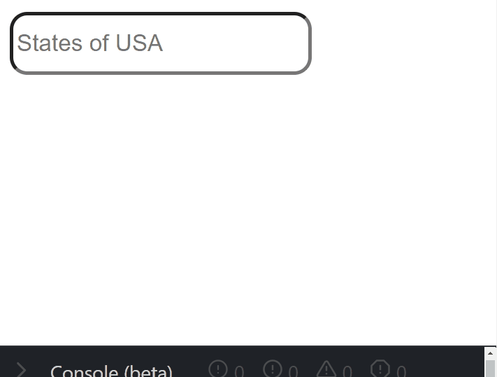

# Wrepit case study

Thank you for taking time out to complete the Wrepit case. This case study is meant as discussion material for the interview in order to hear your reflections and thought process. You will present your work during the interview.

## Case

The link to the design can be found [here](https://www.figma.com/file/XSrwaCekodIduyTnlGHv6V/Wrepit-Case-study?node-id=0%3A1)

### Backend

- Inside this folder you will find a data.json file, add the contents of this file to a database.
- Please use a hosted database.
- Create a rest API that will be an access point to the data.

_You should have the following end point:_

1. An endpoint will allow you to query the data.

You may use a language which you are comfortable in.

### Frontend

- The front app should be created in React.js.

_The site architecture is as follows:_

1. There should be a page that will display the results and allow the results to be searchable. (Home Page).

### Home Page

- Please create a typeahead, that searches through the records, below is an example of a typeahead that searches through states in America.

- Please display all records from the endpoint as per the design.

## Submission

- Clone this repo
- Create your own repo in git
- Push your code to the repo, please ensure that your repo is private.
- If you have time, please deploy your application to a hosted service of your choice.

You should provide contributor access to the repo to the following git accounts:

1. cameronmoodley
2. eirikeis

## Misc

- You may take any and all reasonable assumptions as necessary, but any assumption you take should be explained.
- We do not expect you to spend more than 3.5 hours on the case in total - we respect your time
- You can use pseudo code, to describe what you would have done given enough time, if time runs out.
- Please send us the code, a link to the repository or similar at least 24 hours before the interview for us to look through
- If you have any questions or concerns, please let us know: eirik@wrepit.no or cameron@wrepit.no
